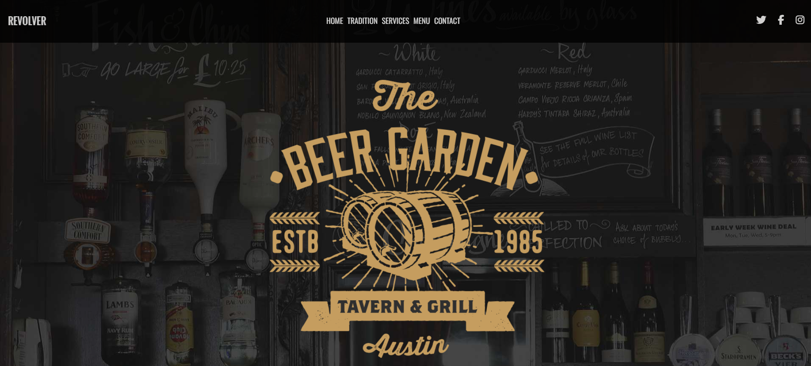
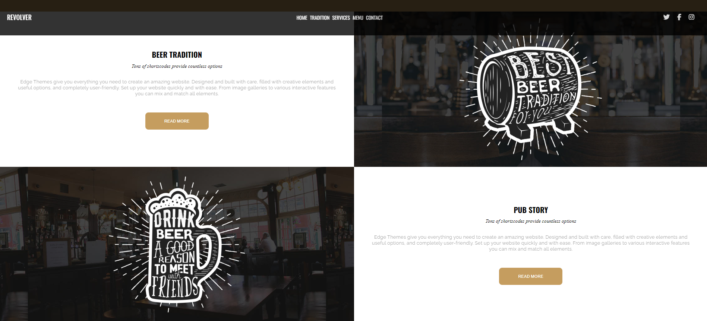
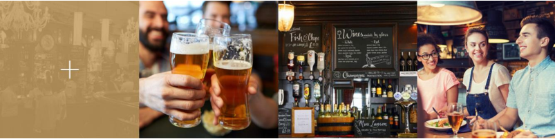

# Beergarden

Projet en front d'une page d'accueil 

### Responsive design
Avec media queries et une navbar "menu burger" à l'aide de javascript

### Utilisation:
HTML, CSS, font-awesome, font-family, javascript

